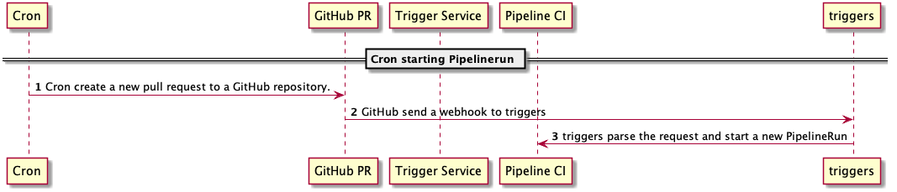
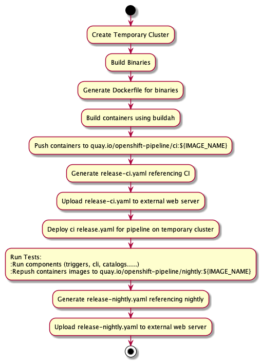
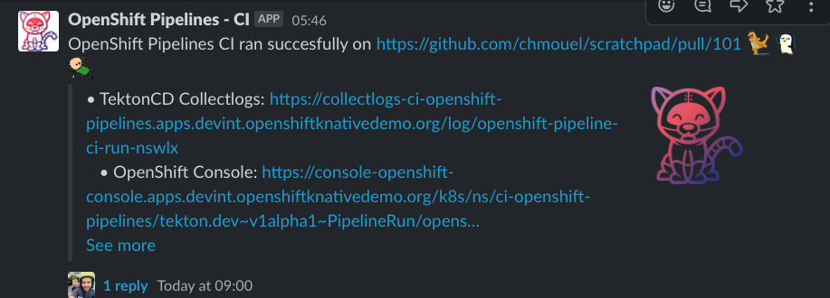
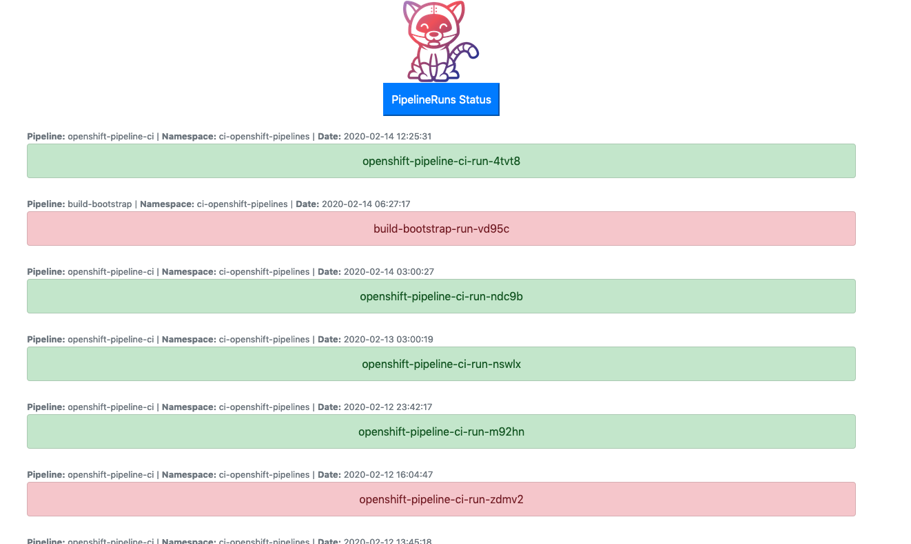
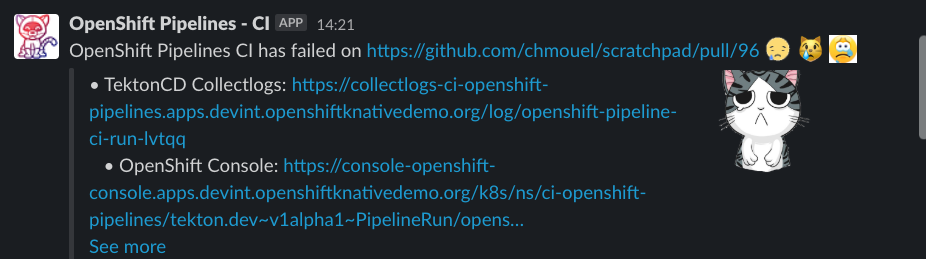

# Introduction

This is the main repository where OpenShift-Pipeline `mid-stream` gets build and validated.

This allows validating every night the `upstream` changes running on Red Hat
OpenShift Container Platform.

## Flow

### Bootstrap

The Bootstrapping is done on the [openshift knative devint
cluster](https://github.com/openshift-knative/cluster-devint).

The devint cluster is a stable cluster with a stable version of tekton and no
cluster-admin rights. This is where we install all our Tasks, Resources and
Pipeline and where the Cron kicks off every night.

When the cron run it will create a new pull request on https://github.com/chmouel/scratchpad to start kicking the process.

This repository (to be moved somewhere else) is only here for tracking and
doesn't contain any meaningfull file except the hooks configuration sending the
new pull request webhook to the triggers install on devint.

[](docs/images/cron-start.png)

###### [source](docs/diagrams/cron-start.plantuml)

### Pipeline start.

We are first setting the PR as pending with Github CI status API.

We need a temporary cluster where we will do our work so we spin one on the
openshift aws dev account (TBC) with the latest version of OpenShift.

We then start building pipeline binaries, we create the
dockerfiles using RHEL base images and push them to quay.io.

We then create a `release-ci.yaml` referencing the installs and install it on
our new temporary cluster.

[](docs/images/pipeline-cibootstrap.png)

###### [source](docs/diagrams/pipeline-cibootstrap.plantuml)

## Components

Before doing the final push there we validate the components, like triggers, cli and catalogs

### Triggers

Triggers task needs to be deployed the same way we do pipeline.

- We build binaries
- Generate dockerfiles
- Build the containers
- Push it to the registry
- Generate a release.yaml
- Push it to quay.io
- Install it on the temporary cluster
- Run the GO E2E tests.
- Run the Yaml tests (only validation)

### End Pipeline

* We have now validated our pipeline and we can produce and upload a final
 `release-nightly.yaml`

* We report it as succeeded on the GitHUB PR itself.

* We send a message on the `Red Hat - CoreOS ` slack tekton channel with the
  link to the logs.

[](docs/images/success.png)

* We have the logs collected with [collectlogs](https://github.com/chmouel/tektoncd-collectlogs/) onto here :

https://collectlogs-ci-openshift-pipelines.apps.devint.openshiftknativedemo.org/

[](docs/images/collectlogs-screenshot.png)

## Artifacts produced nightly

* Nightly pipeline release.yaml - https://uploader-ci-openshift-pipelines.apps.devint.openshiftknativedemo.org/release/pipeline/pipeline-nightly.yaml
* Nightly triggers release.yaml - https://uploader-ci-openshift-pipelines.apps.devint.openshiftknativedemo.org/release/pipeline/triggers-nightly.yaml
* Nightly images - https://quay.io/repository/openshift-pipeline/nightly?tag=latest&tab=tags
* Nightly TektonCD CLI image - `quay.io/openshift-pipeline/nightly:cli`

## Debugging

All file for debugging are encrypted in here :

https://uploader-ci-openshift-pipelines.apps.devint.openshiftknativedemo.org/CI/openshift-pipelines-install/

Usually when there is a failure you would want to grab the `kubeconfig` :

```
curl https://uploader-ci-openshift-pipelines.apps.devint.openshiftknativedemo.org/CI/openshift-pipelines-install/kubeconfig.gpg|gpg -d -q > ~/.kube/config.CI
export KUBECONFIG=~/.kube/config.CI
```

cluster stays up if there is a failure for you to debug, unless someone decides
to rerun the pipeline.

Look for the namespaces where it has failed and inspect there what went wrong :

```
kubernetes get ns|egrep -v '^(openshift(-)?|kube-|default|tekton-pipelines)'
```

There is multiple shortcut script to rerun a specific task directly, for example :

```
./misc/run-pipeline-test.sh
```

will rerun the pipeline tests task directly against the temporary cluster
without rerunning the full thing.

## Associated components

* [go-simple-uploader](https://github.com/chmouel/go-simple-uploader): A simple
and secure HTTP installer where we upload assets, release files and logs
(gpg encrypted to tektoncd team).

* [tektoncd-collectlogs](https://github.com/chmouel/tektoncd-collectlogs/): An
operator and a flask web ui collecting pipelinerun logs in a database and
showing them. This allow long term storage of the runs and some easy
filtering/search (Not implemented yet). Another feature of this component is to
feed all finished pipelineruns to tekton triggers this is how we handle failure,
triggers would see it as a PipelineRun (via CEL) and start a slack task to
notify the channel about the failure.

[](docs/images/failure.png)

Exposed here: https://collectlogs-ci-openshift-pipelines.apps.devint.openshiftknativedemo.org/
