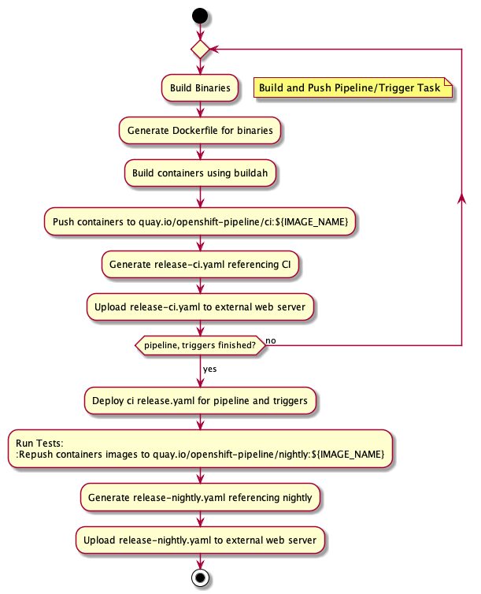
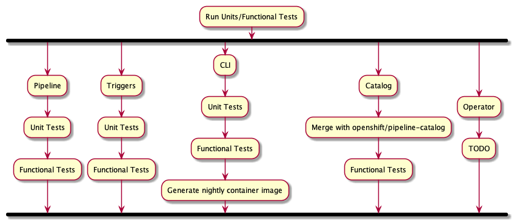
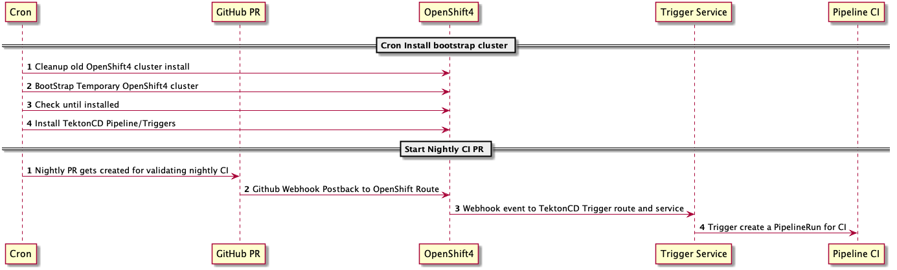

# Introduction

This is the main repository where OpenShift-Pipeline `midstream` gets build and validated.

This allows validating every night the `upstream` changes running on Red Hat
OpenShift Container Platform.


## Flow

### Bootstrap

Since we are running in an environment where there is no stable OpenShift4 we
need to spin-up every night a new OpenShift 4 install.

This is done in a CRON running on OpenShift-CI kubernetes infrastructure.

We install latest version of OpenShift Pipeline and  Triggers.

We then start the [`start.sh`](start.sh) script to install and setting up the
pipeline and the triggers service.

We create a Pull Request in openshift-plumbing repository which would get picked
up by Webhook and Triggers.

[](docs/images/cron-setup.png)
###### [source](docs/diagrams/cron-setup.plantuml)

### Pipeline start.

At first we build the pipeline and triggers binaries, create dockerfiles for
it and push them to quay.io. We then create a `release-ci.yaml` referencing the
installs and install it on our cluster.

[](docs/images/pipeline-cirun.png)
###### [source](docs/diagrams/pipeline-cirun.plantuml)

## Runnings tests

We are now running the different tests for the different components.

[](docs/images/run-test.png)
###### [source](docs/diagrams/run-test.plantuml)

### End Pipeline

We have now validated our pipeline and we can produce and upload a final
`release-nightly.yaml`

[](docs/images/cron-end.png)
###### [source](docs/diagrams/cron-end.plantuml)

### Report back to GitHUB/Slack

TODO:

# Usage

start configuring your config.sh with all the credentials/variable needed using
the [config.sh.sample](config.sh.sample) as a starting point.

Run it with :

```
./start.sh
```

and watch the log output until its done. 

It usually takes more than 2h to do the whole shbang
